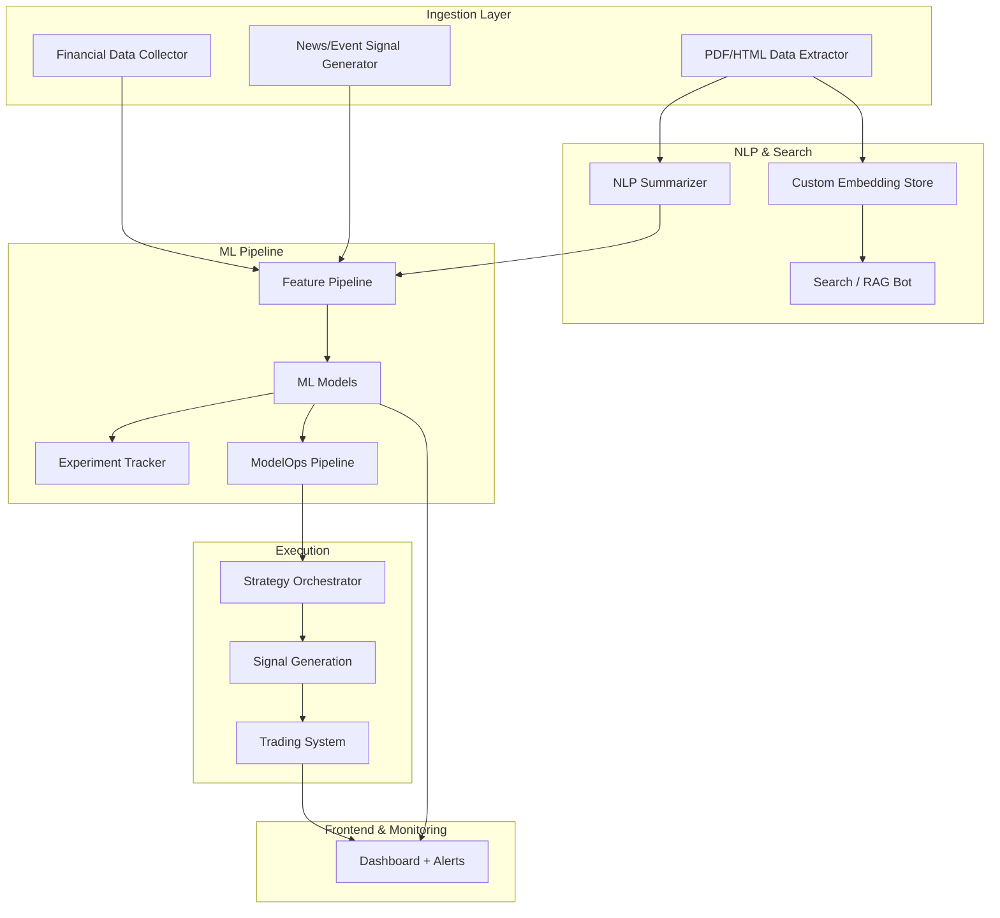

### Overview

This document outlines a modular toolkit composed of key AI-powered components. Each module is independently valuable and monetizable, but together they form the foundation of a highly adaptive, data-driven trading system.

Below each module, we've also listed **recommended open-source tools** that can be used to implement them effectively. . Each module is independently valuable and monetizable, but together they form the foundation of a highly adaptive, data-driven trading system.

---

## 📈 1. Financial Data Collector

**Recommended Tools:**

- `yfinance`, `pandas-datareader`, `fredapi`: financial and macro data ingestion
- `investpy`, `EOD Historical Data` (API wrappers)
- `alpaca-py`, `ccxt`: broker and price data access

---

## 📄 2. PDF/HTML Data Extractor

**Recommended Tools:**

- `PyMuPDF`, `pdfplumber`: PDF parsing
- `BeautifulSoup`, `Playwright`, `Selenium`: web scraping
- `GROBID`: structured document extraction

---

## 📰 3. News/Event Signal Generator

**Recommended Tools:**

- `FinBERT`, `VADER`: financial sentiment analysis
- `transformers` (HuggingFace): classification and summarization
- `NewsAPI`, `GNews`, `AYLIEN`: real-time news ingestion APIs

---

## 📝 4. NLP Summarizer (Finetuned)

**Recommended Tools:**

- `transformers` (HuggingFace): `BART`, `T5`, `Pegasus`
- `Haystack`, `LangChain`: summarization pipelines with context

---

## 🔍 5. Custom Embedding Store

**Recommended Tools:**

- `FAISS`, `Chroma`, `Qdrant`: open-source vector DBs
- `sentence-transformers`, `OpenAI`, `MiniLM`: embedding models

---

## 🤖 6. Search / RAG Bot

**Recommended Tools:**

- `Haystack`, `LangChain`, `LlamaIndex`: RAG framework stacks
- `FastAPI` or `Flask`: serve as chatbot backends

---

## 🧬 7. Feature Pipeline

**Recommended Tools:**

- `pandas`, `polars`: core transformation logic
- `Featuretools`, `TSFresh`, `Kats`: automated feature generation

---

## 🧪 8. Experiment Tracker

**Recommended Tools:**

- `MLflow`, `Weights & Biases (W&B)`: experiment tracking and model registry

---

## 📦 9. ML Models

**Recommended Tools:**

- `scikit-learn`, `XGBoost`, `LightGBM`: tabular models
- `PyTorch`, `TensorFlow`: deep learning pipelines
- `AutoGluon`, `H2O.ai`, `TPOT`: AutoML tooling

---

## 🛠️ 10. ModelOps Pipeline

**Recommended Tools:**

- `MLflow`, `Seldon`, `BentoML`: model packaging and serving
- `FastAPI`, `Docker`, `KServe`: deployment infra

---

## 🧭 11. Strategy Orchestrator

**Recommended Tools:**

- `Backtrader`, `bt`, `QuantConnect`: strategy execution and rule-based systems

---

## 📶 12. Signal Generation

**Recommended Tools:**

- Integrated directly from model output and strategy logic
- Custom code or `Backtrader` logic blocks

---

## 💹 13. Trading System

**Recommended Tools:**

- `ccxt`, `alpaca-trade-api`, `IB-insync`: trading API integrations
- `FastAPI`, `asyncio`, `Kafka`: signal execution pipeline

---

## 📊 14. Dashboard + Alerting System

**Recommended Tools:**

- `Streamlit`, `Dash`, `Gradio`: dashboard UI frameworks
- `Prometheus + Grafana`: system metrics and alerts

---

### Integration Notes:

- **All modules feed into a modular trading engine
- **Summarizer + Embedding Store + Search Bot = financial RAG interface**
- **News/Event module integrates early in the pipeline, supports real-time signal generation**
- **Feature Pipelines + Models + Tracker = ML backbone**
- **ModelOps + Strategy + Signal Gen = deployment & logic layer**
- **Dashboard = insights and transparency layer**

---

## 🐳 Docker-Oriented System Architecture

### Modular Services Map

| Service Name       | Module                      | Container Tech Suggestion               |
| ------------------ | --------------------------- | --------------------------------------- |
| `data_collector`   | Financial Data Collector    | Python + `yfinance`, `alpaca`, etc.     |
| `doc_extractor`    | PDF/HTML Extractor          | Python + `PyMuPDF`, `bs4`, `playwright` |
| `news_signals`     | News/Event Signal Generator | Python + `transformers`, `NewsAPI`      |
| `nlp_summarizer`   | NLP Summarizer              | HuggingFace + FastAPI                   |
| `embedding_store`  | Embedding Store             | `FAISS`/`Qdrant` service                |
| `rag_bot`          | Search / RAG Bot            | LangChain / LlamaIndex + FastAPI        |
| `feature_pipeline` | Feature Engineering         | Python + `pandas` / `Featuretools`      |
| `ml_models`        | Model Training & Inference  | Python + `scikit-learn` / `PyTorch`     |
| `mlflow`           | Experiment Tracker          | `mlflow` standalone container           |
| `model_server`     | ModelOps Pipeline           | `Seldon`, `BentoML`, or FastAPI         |
| `strategy_core`    | Strategy Orchestrator       | Python + rule logic                     |
| `signal_gen`       | Signal Generation           | Python/AsyncIO service                  |
| `trader`           | Trading Execution           | Python + `ccxt`, `alpaca-trade-api`     |
| `dashboard`        | Dashboard                   | `Streamlit`, `Dash`, or Grafana         |
| `monitoring`       | Alerts & Monitoring         | `Prometheus`, `Grafana`, `Alertmanager` |

### Docker System Diagram

---

