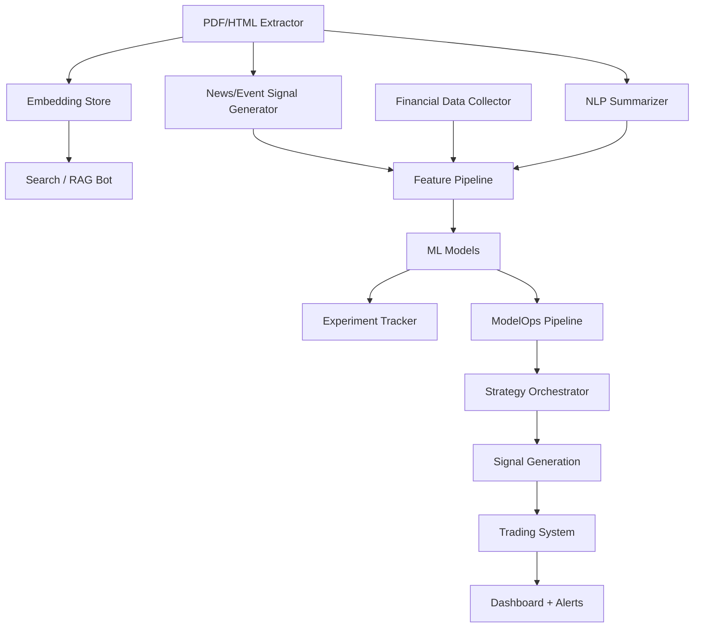

  ## 🧠 Modular AI Tools for Trading, Research, and Monetization
 nhfgvc
### Overview

This document outlines a modular toolkit composed of key AI-powered components. Each module is independently valuable and monetizable, but together they form the foundation of a highly adaptive, data-driven trading system.

---

## 📈 1. Financial Data Collector

**Purpose:**\
Ingest macroeconomic, fundamental, OHLCV, and **structured event** data.

**Supported Data Types:**

- Macroeconomic (e.g. FRED, RBA, ABS)
- Fundamental (e.g. Yahoo Finance, Alpaca)
- Price data (daily/hourly/tick)
- **Structured Events** (e.g. earnings calendars, dividends, central bank meetings)

**Key Characteristics:**

- Structured, factual, and scheduled
- API-driven or calendar-based
- Inputs to model features, dashboards, and strategic scheduling

**Eventually fits into:**

- Feeding structured inputs into feature pipelines
- Providing calendar-aware context to ML and rule-based strategies
- Supporting other modules with reference timelines for scheduled events

**Monetization Potential:**

- API or scheduled data feed
- Dashboard backend
- Developer-ready ingestion SDK

---

## 📄 2. PDF/HTML Data Extractor

**Purpose:**\
Extract and structure data from unstructured sources like regulatory filings, research, news, or government policy documents.

**Targets:**

- Earnings reports
- Company filings (e.g. 10-K, ASX announcements)
- Broker research PDFs
- Web-based financial news

**Eventually fits into:**

- Feeding raw text into summarizers or embedding pipelines
- Creating structured data for model input
- Enabling real-time or batch news/event ingestion workflows

**Monetization Potential:**

- Analyst tools or plugins (e.g. Notion, Obsidian)
- Web app/SaaS for regulatory and earnings analysis

---

## 📰 3. News/Event Signal Generator

**Purpose:**\
Extract **signals** from unstructured or semi-structured sources like financial news, filings, or macroeconomic updates — focusing on **surprise-driven or sentiment-based events**.

**Signal Types:**

- Sentiment spikes, novelty detection, policy surprises
- Mention frequency, earnings surprises, guidance changes
- Phrase-level pattern detection (e.g. “profit warning”)

**Key Characteristics:**

- Unstructured or semi-structured input
- Focus on real-time signal extraction, novelty, and tone
- NLP-driven pipelines for fast news and filing interpretation

**Eventually fits into:**

- Feeding into feature pipelines or strategy triggers
- Generating trade alerts based on breaking events

**Monetization Potential:**

- News signal feed for traders
- Plug-in for terminals, dashboards, research systems

---

## 📝 4. NLP Summarizer (Finetuned)

**Purpose:**\
Generate domain-specific summaries of long financial or regulatory texts.

**Training Focus:**

- Finetune on 10-Ks, ASX announcements, research notes
- Output: investment memos, risk profiles, news digests

**Eventually fits into:**

- Pre-processing for RAG pipelines
- Dashboard assistant insights
- Slack/email alert summarization

**Monetization Potential:**

- Fintech assistant APIs
- AI-powered newsletter engine
- Research automation toolkit

---

## 🔍 5. Custom Embedding Store

**Purpose:**\
Store and retrieve high-dimensional vectors of domain documents for similarity search or chatbot interfaces.

**Components:**

- Document ingestion
- Embedding generation (open models)
- Vector DB + retriever logic

**Eventually fits into:**

- Chatbot/search over financial documents
- Personalized assistant for trading research
- Contextual retriever for LLM pipelines

**Monetization Potential:**

- Developer tool or hosted vector DB
- Component in premium research dashboards

---

## 🤖 6. Search / RAG Bot

**Purpose:**\
Provide interactive Q&A over ingested documents using retrieval-augmented generation (RAG) powered by the Embedding Store.

**Eventually fits into:**

- Assisting analysts and traders with quick access to relevant data
- Surfacing summaries, trends, or policy references on demand
- Surfacing historical precedent for real-time events

**Monetization Potential:**

- White-label chatbot for financial research tools
- Internal research assistant for firms and funds

---

## 🧬 7. Feature Pipeline

**Purpose:**\
Transform raw ingested data into model-ready features (lagged indicators, rolling statistics, sentiment scores, etc.).

**Eventually fits into:**

- ML model training and evaluation
- Feature importance tracking and explainability
- Integrating text-derived features from summarizers or news signals

**Monetization Potential:**

- Feature store API
- Proprietary signals-as-a-service

---

## 🧪 8. Experiment Tracker

**Purpose:**\
Track model experiments, hyperparameters, training metadata, and performance metrics.

**Eventually fits into:**

- Supporting reproducibility and auditability of ML model development
- Comparing performance across training runs and feature sets

**Monetization Potential:**

- Internal use with open-source tools (e.g. MLflow, Weights & Biases)
- Part of an MLOps toolkit for finance teams

---

## 📦 9. ML Models

**Purpose:**\
Train and validate machine learning models using features generated from data pipelines.

**Model Types:**

- Regression, classification, time-series forecasting
- Gradient boosting, transformers, ensembles

**Eventually fits into:**

- Predicting asset returns, risk, volatility, macro trends
- Powering downstream signal generation

**Monetization Potential:**

- Proprietary signal generation
- Subscription signals platform

---

## 🚰 10. ModelOps Pipeline

**Purpose:**\
Automate the packaging, deployment, versioning, and monitoring of ML models.

**Use Cases:**

- Deploy alpha-generating models to production
- Test various model versions in parallel
- Integrate with real-time or batch prediction pipelines

**Eventually fits into:**

- Running and scheduling predictive models for trading strategies
- Monitoring model drift and retraining schedules

**Monetization Potential:**

- CLI toolkit / SaaS for ML engineers
- Premium version for finance-specific workflows

---

## 🧽 11. Strategy Orchestrator

**Purpose:**\
Select or blend signals from multiple models based on macro conditions, volatility regimes, or portfolio rules.

**Eventually fits into:**

- Managing ensemble models or conditional strategies
- Enabling context-aware signal prioritization
- Handling conditional logic for event-based trading triggers

**Monetization Potential:**

- Proprietary trading engine layer
- Integration module for quant platforms

---

## 📶 12. Signal Generation

**Purpose:**\
Convert model outputs and strategies into tradeable signals or scores.

**Eventually fits into:**

- Signal dashboards, alerting, or execution interfaces
- Portfolio construction and rebalancing logic
- Translating event/news triggers into signal strength scores

**Monetization Potential:**

- Signal-as-a-service platform
- Part of managed trading infrastructure

---

## 📉 13. Trading System

**Purpose:**\
Execute signals on connected broker or exchange APIs. Apply position sizing, risk management, and execution policies.

**Eventually fits into:**

- Live and paper trading environments
- Strategy simulation and performance reporting

**Monetization Potential:**

- Proprietary strategy infrastructure
- Automated execution engine for quant clients

---

## 📊 14. Dashboard + Alerting System

**Purpose:**\
Visualize outputs from summarizers, models, or signals. Trigger alerts for significant events or trade conditions.

**Eventually fits into:**

- Monitoring models and strategies in real-time
- Providing human-in-the-loop interpretability and insights
- Sending alerts triggered by news/event-based changes

**Monetization Potential:**

- Internal monitoring UI
- Customizable dashboards for research clients or users

---

## 🧹 How It All Fits Together

### Integration Notes:

- **Financial Data Collector handles structured, scheduled events**; News/Event Signal Generator reacts to **unstructured, unexpected signals**
- **Summarizer + Embedding Store + Search Bot = financial RAG interface**
- **News/Event module integrates early in the pipeline, supports real-time signal generation**
- **Feature Pipelines + Models + Tracker = ML backbone**
- **ModelOps + Strategy + Signal Gen = deployment & logic layer**
- **Dashboard = insights and transparency layer**

---

### ♻️ Next Steps

1. Break each section into its own `*.md` spec file.
2. Start prototyping **one module** (suggestion: Financial Data Collector or ModelOps pipeline).
3. Define shared schema and interfaces (e.g. JSON for data passing).
4. Explore monetization paths (CLI tools, APIs, SaaS dashboards, plugins).

